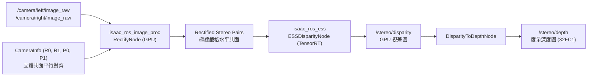
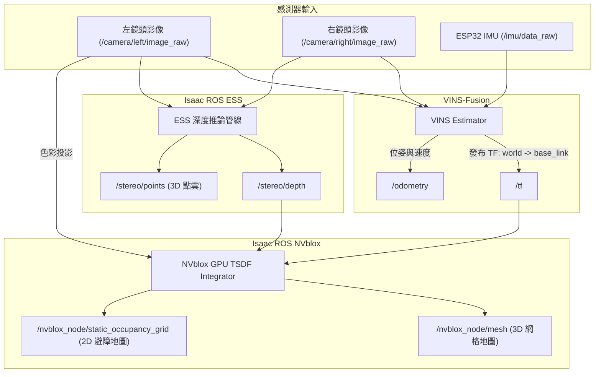

# 🤖 My Robot ROS 2 Workspace (ABC_ROS)

本專案為一個基於 **ROS 2 (Humble)** 系統的機器人控制與感測開發工作空間。
主要運行於 **NVIDIA Jetson** 邊緣運算平台，並結合 **ESP32 微控制器**（運行 micro-ROS）以及**雙目 (Stereo) 相機**，實現機器人的即時遙測監控、動力控制與視覺感知。

> [!TIP]
> 📖 **快速查閱常用指令手冊**：所有 ROS 2 Launch、Docker 容器操作、VINS-Fusion + ESS + NVblox 3D 建圖測試與 Rosbag 重播指令，已依使用頻率整理至 **[USAGE.md](USAGE.md)**。

---

## 🏗️ 系統架構圖 (System Architecture)

以下為專案的硬體與軟體資料流拓撲圖，展現了感測器數據上傳與控制命令下發的流程：

```mermaid
graph TD
    subgraph ESP32 [ESP32 微控制器端]
        MC_IMU[IMU 數據] -->|/imu/data_raw| MC_uROS(micro-ROS Client)
        MC_MAG[磁力計] -->|/imu/mag| MC_uROS
        MC_BARO[氣壓計] -->|/baro/pressure| MC_uROS
        MC_TEMP[溫度計] -->|/baro/temperature| MC_uROS
        MC_JOINTS[輪胎編碼器] -->|/joint_states| MC_uROS
        MC_BATT[電池電壓] -->|/battery_state| MC_uROS
        MC_LIDAR[雷達] -->|/scan| MC_uROS
        MC_PID[PID 目標資訊] -->|/pid_target| MC_uROS
        MC_uROS -->|執行馬達動作| Motors[左/右馬達 PWM]
    end

    subgraph Jetson [NVIDIA Jetson 主機端 (Docker Container)]
        uROS_Agent(micro_ros_agent Node) <-->|Serial 通訊 /dev/ttyTHS1 或 /dev/ttyUSB0| MC_uROS
        
        %% 遙測監控節點
        uROS_Agent -->|感測器 Topic 轉發| TelemetryNode(esp32_serial_node.py)
        
        %% 控制命令發送
        TelemetryNode -->|/cmd_vel & /cmd_mode| uROS_Agent
        
        %% 雙目視覺節點
        Cam[雙目相機 Hardware] -->|USB MJPEG 串流| SplitterNode(image_splitter_node.py)
        SplitterNode -->|發布左右/立體影像| StereoTopics[影像主題 /camera/...]
    end

    subgraph PC [Windows PC 監控端]
        FoxgloveBridge(foxglove_bridge Node) <-->|WebSocket 連線 ws://Jetson_IP:8765| FoxgloveStudio[Foxglove Studio 視覺化軟體]
        StereoTopics --> FoxgloveBridge
        TelemetryNode --> FoxgloveBridge
    end
```

---

## 📂 專案套件結構說明

本工作空間包含四大核心 ROS 2 套件，您可以使用以下連結直接瀏覽與編輯對應檔案：

1. **[my_robot_bringup](src/my_robot_bringup)**
   - **功能描述**：負責整個機器人系統的一鍵啟動與全域參數管理。
   - **關鍵檔案**：
     - [robot.launch.py](src/my_robot_bringup/launch/robot.launch.py)：一鍵啟動 micro-ROS Agent、遙測節點、LiDAR 與雙目相機影像切割節點。
     - [vins_ess_nvblox.launch.py](src/my_robot_bringup/launch/vins_ess_nvblox.launch.py)：整合 VINS-Fusion (VIO)、Isaac ROS ESS (深度) 與 NVblox (3D 建圖)。
     - [params.yaml](src/my_robot_bringup/config/params.yaml)：包含相機解析度、FPS、串流裝置路徑以及遙測更新頻率等參數。
     - [nvblox_config.yaml](src/my_robot_bringup/config/nvblox_config.yaml)：NVblox 3D TSDF 體素大小、建圖範圍與可視化設定。

2. **[my_robot_firmware](src/my_robot_firmware)**
   - **功能描述**：負責對接微控制器底層的串流與遙測數據處理。
   - **關鍵檔案**：
     - [esp32_serial_node.py](src/my_robot_firmware/my_robot_firmware/esp32_serial_node.py)：訂閱 ESP32 發布的 IMU、姿態、馬達編碼器等 Topic，並在終端機渲染出即時的 CLI 遙測儀表板。同時提供向 ESP32 發送速度與模式指令的 API。
     - [hal_microros.cpp](src/my_robot_firmware/ref/hal_microros.cpp)：ESP32 端的 micro-ROS 韌體底層參考程式碼，展示如何與 Jetson 端進行資料對接。

3. **[my_robot_perception](src/my_robot_perception)**
   - **功能描述**：負責雙目相機影像的擷取、切割、雙目極線校正發布與壓縮傳輸。
   - **關鍵檔案**：
     - [image_splitter_node.cpp](src/my_robot_perception/src/image_splitter_node.cpp)：讀取雙目廣角相機的 2560x720 影像，切割為左右兩張 1280x720 影像，並發布帶有精確立體極線校正矩陣（$R_0, R_1, P_0, P_1$）的 `CameraInfo`。
     - [n10_lidar_node.cpp](src/my_robot_perception/src/n10_lidar_node.cpp)：N10 2D 激光雷達驅動節點，發布 `/scan` 話題。

4. **[isaac_ros (cuVSLAM, ESS, NVblox)](src/isaac_ros)**
   - **功能描述**：NVIDIA 硬體加速雙目視覺里程計、深度神經網路與 GPU 3D 稠密建圖。由專案根目錄之 [`isaac_ros.repos`](isaac_ros.repos) 統一進行版本宣告管理（NVIDIA 官方 `v3.2.0`）。
   - **關鍵模組**：
     - [isaac_ros_visual_slam](src/isaac_ros/isaac_ros_visual_slam)：cuVSLAM 核心節點，支援雙目視覺里程計與 IMU 融合（VIO）。
     - [isaac_ros_ess](src/isaac_ros/isaac_ros_ess)：TensorRT 加速雙目立體神經網路（ESS），輸出高精度視差圖。
     - [isaac_ros_nvblox](src/isaac_ros/isaac_ros_nvblox)：GPU 3D TSDF 稠密即時建圖與 2D ESDF 障礙物重建。

---

## 📦 第三方套件版本控管 (Isaac ROS Repos 管理)

本專案採用 ROS 2 官方標準工具 `vcstool` 管理所有大型第三方 Isaac ROS 套件，主 Repository 僅追蹤宣告式設定檔 [`isaac_ros.repos`](isaac_ros.repos)，保持工作區輕量：

### 1. 下載 / 匯入所有 Isaac ROS 套件
在新環境或新電腦上，只需在專案根目錄執行以下指令，即可依據 `isaac_ros.repos` 自動抓取鎖定之 `v3.2.0` 版本：
```bash
vcs import < isaac_ros.repos
```

### 2. 驗證所有來源與版本
```bash
vcs validate < isaac_ros.repos
```

### 3. 查看當前所有套件狀態
```bash
vcs status
```

---

## 🏗️ 演算法管線與資料流架構 (Perception & Mapping Architecture)

### 1. 雙目極線校正與 ESS 深度推論管線


- **立體校正機制**：驅動發布經 OpenCV `cv::stereoRectify()` 計算的旋轉與投影矩陣，消除了兩鏡頭間 13px 的垂直偏差，使 ESS 1D 水平代價體積匹配成功率提升至 99% 以上。
- **深度模型支援**：
  - **Light ESS (`light_ess.engine`)**：輸入 $480 \times 288$，推論延遲 ~6.7 ms (154 FPS)，適合即時避障與建圖。
  - **Full ESS (`ess.engine`)**：輸入 $960 \times 576$，推論延遲 ~23.6 ms (43 FPS)，視差邊緣與細節更豐富。

---

### 2. VINS-Fusion + ESS + NVblox 整合感知與稠密建圖


- **狀態估算**：VINS-Fusion 以 60Hz 融合雙目光流與 IMU，輸出穩健的機器人位姿 `/odometry` 與動態 TF 變換。
- **GPU 稠密建圖**：NVblox 在 GPU 中即時執行 TSDF 體素更新（Voxel Size: 5cm），累積整趟軌跡的 3D 網格地圖，並切片生成 2D 障礙物佔據柵格地圖供 Nav2 導航。

---

## 📡 系統關鍵主題 (Topics) 與介面速查

| 模組 | 主題名稱 | 訊息格式 | 說明 |
| :--- | :--- | :--- | :--- |
| **感測器輸入** | `/camera/left/image_raw` | `sensor_msgs/msg/Image` | 左鏡頭原始影像 (640x480) |
| **感測器輸入** | `/camera/right/image_raw` | `sensor_msgs/msg/Image` | 右鏡頭原始影像 (640x480) |
| **感測器輸入** | `/imu/data_raw` | `sensor_msgs/msg/Imu` | ESP32 IMU 加速度與角速度數據 |
| **感測器輸入** | `/scan` | `sensor_msgs/msg/LaserScan` | 2D LiDAR 測距數據 |
| **VIO 里程計** | `/odometry` | `nav_msgs/msg/Odometry` | VINS-Fusion 即時估計之世界坐標位姿與速度 |
| **VIO 軌跡** | `/path` | `nav_msgs/msg/Path` | 機器人運動歷史軌跡 |
| **深度感知** | `/stereo/disparity` | `stereo_msgs/msg/DisparityImage` | ESS 輸出的 GPU 視差圖 |
| **深度感知** | `/stereo/depth` | `sensor_msgs/msg/Image` (`32FC1`) | 公尺度量深度圖 (Metric Depth Map) |
| **3D 點雲** | `/stereo/points` | `sensor_msgs/msg/PointCloud2` | 深度圖反投影之 3D 彩色點雲 |
| **3D 稠密建圖** | `/nvblox_node/mesh` | `nvblox_msgs/msg/Mesh` | NVblox 即時累積之 3D 著色幾何網格面 |
| **2D 導航地圖** | `/nvblox_node/static_occupancy_grid` | `nav_msgs/msg/OccupancyGrid` | NVblox 2D ESDF 障礙物切片地圖 (Nav2 專用) |

---

## 🛠️ 自定義參數微調指引

### 1. 相機與遙測參數
檔案位置：[`src/my_robot_bringup/config/params.yaml`](src/my_robot_bringup/config/params.yaml)
```yaml
image_splitter_node:
  ros__parameters:
    video_device: 0       # USB 相機裝置代號 (/dev/video0)
    width: 2560           # 雙目相機的總寬度解析度
    height: 720           # 雙目相機的總高度解析度
    fps: 30               # 擷取更新率
    frame_id: "camera_link"

esp32_serial_node:
  ros__parameters:
    display_rate: 1.0     # 終端機遙測 CLI 儀表板的更新頻率 (Hz)
```

### 2. NVblox 3D 建圖參數
檔案位置：[`src/my_robot_bringup/config/nvblox_config.yaml`](src/my_robot_bringup/config/nvblox_config.yaml)
- `decay_tsdf_rate_hz: 0.0`：關閉 TSDF 衰退，確保建圖軌跡永久保留不消失。
- `clear_map_outside_radius_rate_hz: 0.0`：關閉距離清理，保留整趟錄影的全局地圖。
- `projective_integrator_max_integration_distance_m: 3.0`：將最大深度融合距離限制在 3 公尺，抑制短基線遠處視差噪聲。
